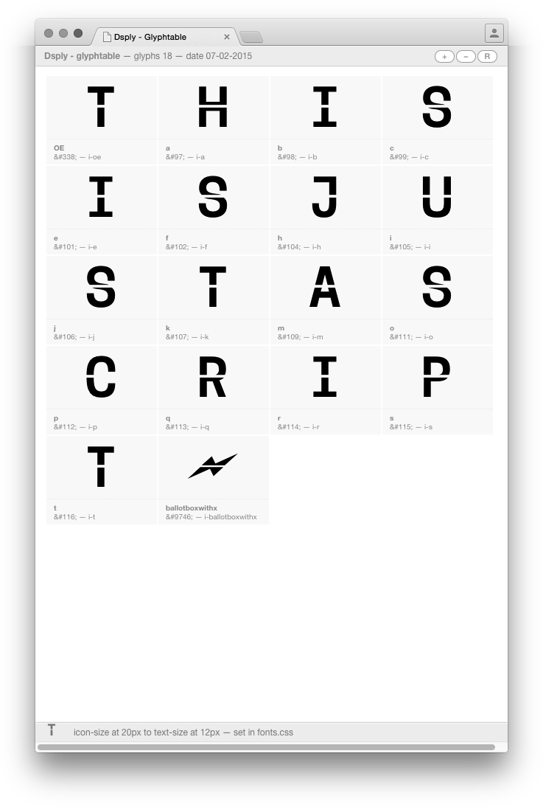
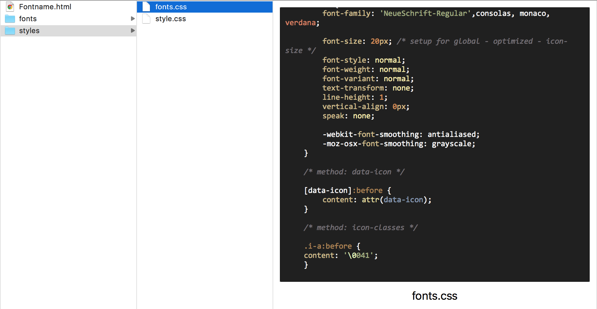

# Make Html Web Glyphtable
Version 1.0*

WHAT THIS SCRIPT DOES
-----------------------------------------------------------------------
This script generates html/css-files for using your font in web.

It uses two of the basic methods you can use your font in web *(see font.css)*.
The script only generates files for *'valid'* glyphs, this means with *'content',
'export-permission' and 'unicode'* (at least except the *'softhyphen'*).
For checking see the report in the output-panel.

There will be directories *near your glyphs-file* with:

* html-file for an overview
* style.css, with basic styling for html-file
* font.css, with basic styling for the web-fonts

NOTES ON THIS SCRIPT
-----------------------------------------------------------------------
* uses vanilla (see *mekkablue on github* for installation)
* prefer browsing in google chrome
* For now, the script just use the informations of *first* instance to generate files, *not* the active master

USAGE
-----------------------------------------------------------------------
Make a selection of 'valid' glyphs and run the script.
Then you have to export your font as web-font to the recommended directory.
Finish. Maybe you want to modificate the files (see Modifications).

MODIFICATIONS
-----------------------------------------------------------------------
* this script uses *20px* default for icon-size (relation to regular text) *and* view-size (view in the icon panels).
* you can modificate global the icon-size in "fonts.css" *(fonts.css -- line 16)*.
* if you use this script again you can set your icon-size-value as default in the script	*(py-script -- line 17)*.
* icon-size and view-size are the same. if necessary set the view-size different *(styles.css -- line 66)*.

TODOS
-----------------------------------------------------------------------
* would be nice to export web-font-package automaticly ... waiting for georg and g2-updates
* maybe it is usefull to generate a file for more instances ...
* could be nice to use some interactions via javascript in the html ...
* also could be more comfortable to deal with the font-sizes/ view-sizes ...
* make it possible to choose the 'lead-icon' via selection ...
* looking for more 'exceptions' mmh ...

* all others, which can be improved, waiting for suggestions ...

KNOWN BUGS
-----------------------------------------------------------------------
* icon-panel-boxes could 'jump' vertically, while use this script for build-out-of-Glyph font

# FontInspector-Glyphs-modified

This script based on Ondrej Jóbs FontInspector. see http://urtd.net/projects/fontinspector/.

I just added some modifications for the Font Editor Glyphs.

* updates for Glyphs 2
* enable/disable interface update
* dont close open path automaticly
* open macro
* handle with components
 
 
# Smaler Scripts

* Name and delete Guidelines. Does what it says.